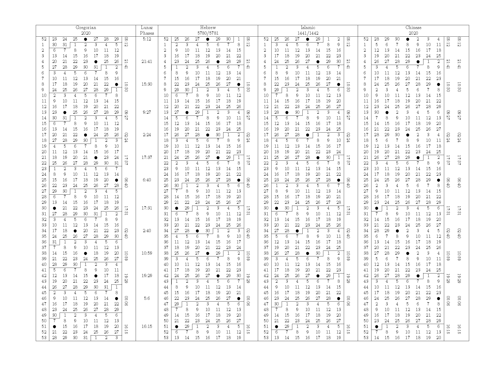

# Candybar

Candybar is a Python library for computing different calendars and displaying then in a rectangular format. The goal is to produce output similar to Appendix C of Reingold & Dershowitz.



## Installation

```
pip install git+https://github.com/rn123/candybar#egg=candybar
```

## Usage

```python
from candybar import candybar

cal = candybar.TextCandyBar(2020)
cal.prcandybar()
```

## License
Includes a version of pycalcal

[MIT](https://choosealicense.com/licenses/mit/)
