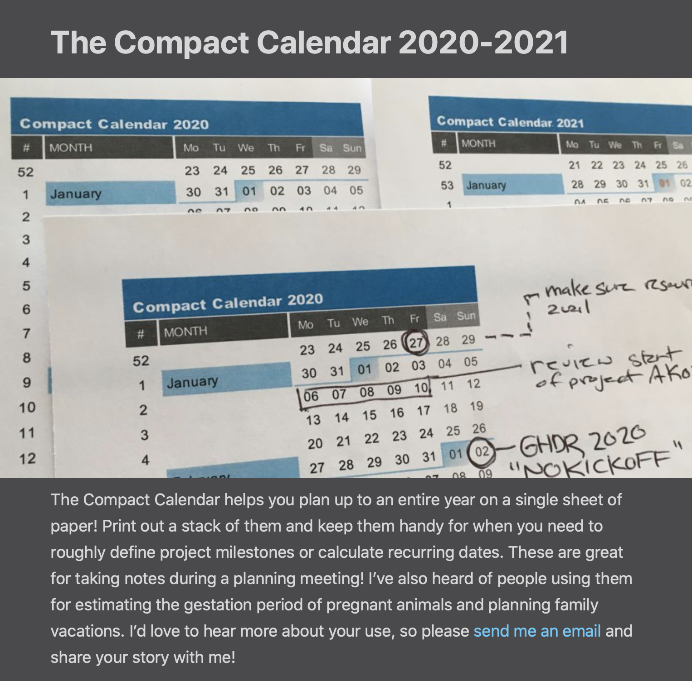
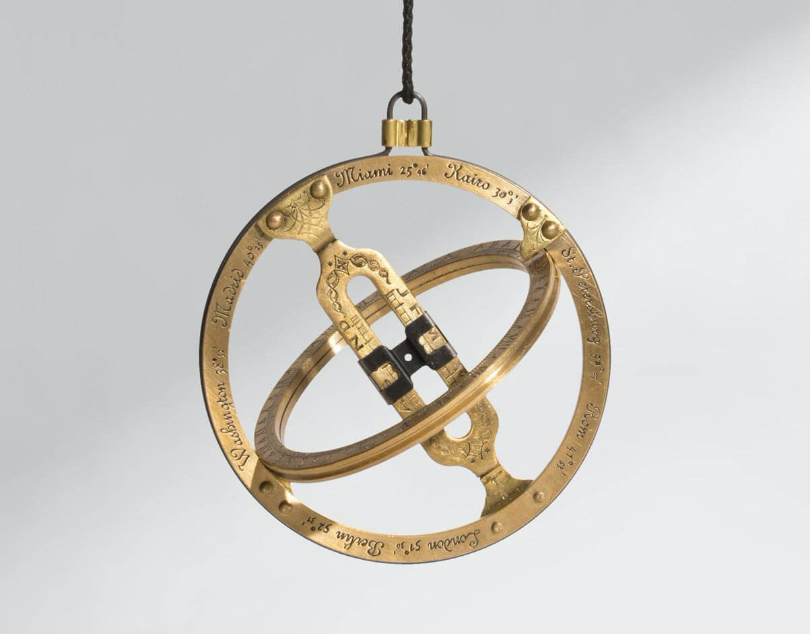
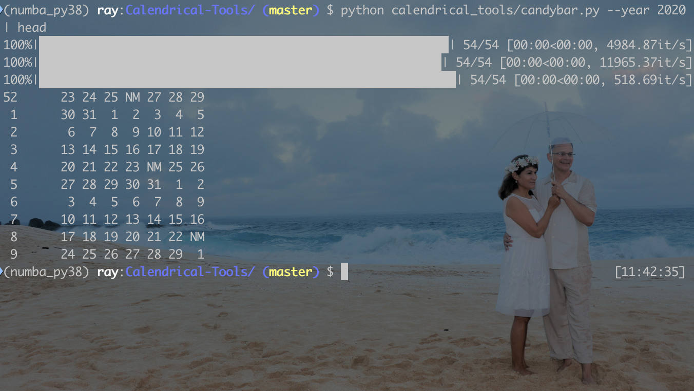
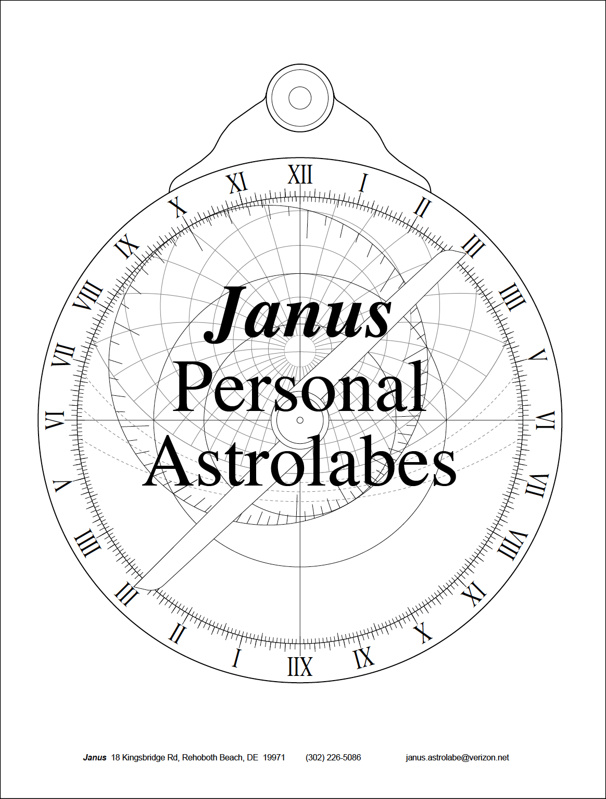

# Calendrical Tools 2020


## Concept

Inspired by David Seah's [Compact Calendar](https://davidseah.com/node/compact-calendar/) project that produces a one page time-management tool, this GitHub repository is a set of python code that computes "candybar calendars" for various calendrical traditions. The idea of calling these candy bar calendars is introduced by David Seah: 


> The Compact Calendar presents days as a continuous candy bar of time. Because the weeks are presented as a stack of available time, it’s easy to block out days naturally as you think. There’s a lot of free space available on the right-side of the sheet for note taking.

Amature astronomy and computational inspirations are from the fantasic books by Reingold & Dershowitz, "Calendrical Computations" and James Morrison, "The Astrolabe." 

Close study of Reingold & Dershowitz (mainly from the 3rd edition, although my copy of the 4th edition is on it's way from Amazon) and the [python implementation](https://github.com/espinielli/pycalcal) by Enrico Spinielli, as well as cited references, has been a factor in my amature astronomy passion for a long time.

Likewise, the study of computing and drawing astrolabes inspired by James Morrison has been a passion. In the 90's I bought his lamenated cardboard astrolabes (and later his book) that have fed a passion for decades. By the way, if working versions of ancient astrolabes is your thing, you should also take a look at [Kala's pocket sundial](https://www.pocket-sundial.com/products/kala-sundial).


The concept of the project is to develop tools on top of Spinielli's ```pycalcal``` (which itself is based on Reingold & Dershowitz's lisp implementaion, ```calendrica 3.0```) code that compute's candybar calendars that are accurate over the historical time period and in the many calendrical traditions documented in Reingold & Dershowitz. Extending the idea, for any historical date and location the project generates an accurate static astrolabe view of the sky.
<br/>


<br/>

## Suggested Bibliography


- Reingold, Edward M. Calendrical Calculations: The Ultimate Edition. 4 edition. Cambridge ; New York: Cambridge University Press, 2018.
- [Morrison, James E.](https://web.archive.org/web/20051210070051/http://www.astrolabes.org/personal.htm) The Astrolabe. Softcover. Janus, 2007.
- Cullen, Christopher. Heavenly Numbers: Astronomy and Authority in Early Imperial China. 1 edition. Oxford, United Kingdom ; New York, NY, United States of America: Oxford University Press, 2018.
- Heilbron, J. L. The Sun in the Church: Cathedrals as Solar Observatories. Harvard University Press, 1999.
- Evans, James. The History & Practice of Ancient Astronomy. Oxford University Press US, 1998.
- Ptolemy, and G. J. Toomer. Ptolemy’s Almagest. Springer-Verlag, 1984.
- Meeus, Jean. Astronomical Algorithms. Willmann-Bell, 1998.
- Kaler, James B. The Ever-Changing Sky: A Guide to the Celestial Sphere. Cambridge University Press, 2002.


