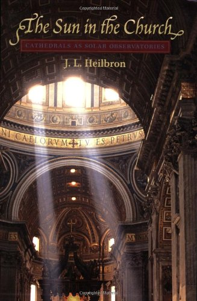

## Concept

Organizing and visualizing the counts of days, moons, and years is fundemental. Over the centuries many devices have been invented for this fundemental purpose, resulting in the rich calendrical and astronomical traditions of world history. Calendrical-Tools builds calendars, diagrams, and timelines to help explore these traditions and their first principles as well as to produce useful devices for managing time from a historically accurate point of view.

Inspired by David Seah's [Compact Calendar](https://davidseah.com/node/compact-calendar/) project that produces a one page time-management tool, ```candybar.py``` is code that computes "candybar calendars" for various calendrical traditions. The candybar view of time organizes day counts into ISO weeks and stacks the weeks up to fill in a calendar year. The idea of calling these candy bar calendars is introduced by David Seah: 


> The Compact Calendar presents days as a continuous candy bar of time. Because the weeks are presented as a stack of available time, it’s easy to block out days naturally as you think. There’s a lot of free space available on the right-side of the sheet for note taking.

Amature astronomy and computational inspirations are from the fantasic books by Reingold & Dershowitz, "Calendrical Computations" and James Morrison, "The Astrolabe." 

Close study of Reingold & Dershowitz (mainly from the 3rd edition, although my copy of the 4th edition is on it's way from Amazon) and the [python implementation](https://github.com/espinielli/pycalcal) by Enrico Spinielli, as well as cited references, has been a factor in my amature astronomy passion for a long time.


Likewise, the study of computing and drawing astrolabes inspired by James Morrison has been a passion. In the 90's I bought his lamenated cardboard astrolabes (and later his book) that have fed a passion for decades. By the way, if working versions of ancient astrolabes is your thing, you should also take a look at [Kala's pocket sundial](https://www.pocket-sundial.com/products/kala-sundial).

The concept of the project is to develop tools on top of Spinielli's ```pycalcal``` (which itself is based on Reingold & Dershowitz's lisp implementaion, ```calendrica 3.0```) code that compute's candybar calendars that are accurate over the historical time period and in the many calendrical traditions documented in Reingold & Dershowitz. Extending the idea, for any historical date and location the project generates an accurate static astrolabe view of the sky.
<br/>


<br/>

## Drawing Astrolabes: The Plate Grid

The plate grid of an astrolabe is the stereographic projection of the celestial sphere through the south celestial pole onto the plane of the equator. Quoting Morrison:

> The interior of the plate can be thought of as a special kind of graph paper for finding the location of celestial objects in the sky at your location. The main difference between normal graph paper and the graph paper on the plate is the lines on graph paper are normally straight while the astrolabe lines are curve. All of the curves on the astrolabe plate are drawn as arcs of circles.

Continuing, here is Morrisons basic description:

> The larger circles centered on the plate represent the Earth's tropics. The largest circle, which defines the outside of the plate, is the Tropic of Capricorn, which is the farthest south the sun ever reaches. The middle circle is the equator and the smaller circle is the sun's northern limit, the Tropic of Cancer. The circles defining the tropic are the same for all latitudes.


Not mentioned is the dependency of the plate on the obliquity of the eclpitic -- the angle that the plane of the Sun's path makes with the axis of the Earth's rotation. From our perspecitve in history, we know of the discovery of the time dependence of the obliquity of the ecliptic. Drawing historically accurate diagrams needs to take into account this time dependence. For a historical account of the discovery and how the obliquity was measured over the last five centuries read Heilbron "The Sun in the Church." 

Morrison continues:

> The straight lines drawn as diameters of the largest circle show direction. The vertical diameter goes north and south through your location, representing your **meridian.** South is at the top and east to the left. The horizontal diameter connects east and west and is the projection of the great circle perpendicular to the meridian. It is normally called the **right horizon**, the horizon at the equator. It is perhaps easiest to visualize the plate as lying flat on a table with the top pointing south. A star chart is held overhead. You look down on an astrolabe, like a compass.

Morrison's book has details about the layout of many tools based on stereographic projections. In particular he does have a chapter on generating star finders. Continuing with the description:

> The plate is used to find the positions of celestial objects in the sky as seen by an observer at a specific location. The interior of the plate is the stereographic projection of the tropics and the local horizontal coordinate system. The arcs on the plate represent positons in the sky. You can find anything in the sky if you know its angle above the horizon and the direction to look. The angle of something in the sky above its horizon is its **altitude** and its direction is its **azimuth.**

The easy part of drawing the plate of an astrolabe is drawing the tropics and the equator:


These circles depend only on the obliquity of the ecliptic.

The circles of equal altitude (almucantars) are given by the following formulas:


In particular, the radius and center for the horizon arc is obtained for an altitude of zero.

The arcs of equal azimuth are given by:


## Drawing Astrolabes: Dividing the Ecliptic

The stereographic projection of the ecliptic is a circle (as is the stereographic projection of a circle) that runs between the extremes of the tropics of cancer and capricorn. So the radius is the average of the radii and the center is half of the difference of the radii.


## The International Organization for Standardization (ISO) Calendar

The Banker's Almanac and Register has been published calendars in the late 1800's are formatted with stacks of weeks similar to Seah's candybar calendars and the format used by Reingold & Dershowits. In fact, this format is well described in the chapter on the ISO Calendar. The (one) reference is for the ISO Standard [ISO 8601:2000(E)](http://www.pvv.org/~nsaa/8601v2000.pdf).


> A calendar week is identified within a calendar year by the calendar week number. This is its ordinal position within the year, applying the rule that the first calendar week of a year is the one that includes the first Thursday of that year and that the last calendar week of a calendar year is the week immediately preceding the first calendar week of the next calendar year.

> NOTE 1 These rules provide for a calendar year to have 52 or 53 calendar weeks;

> NOTE 2 The first calendar week of a calendar year may include up to three days from the previous calendar year; the last calendar week of a calendar year may include up to three days from the following calendar year;

> NOTE 3 The time-interval formed by the week dates of a calendar year is not the same as the time-interval formed by the calendar dates or ordinal dates for the same year. For instance:
  — Sunday 1995 January 1 is the 7th day of the 52nd week of 1994, and — Tuesday 1996 December 31 is the 2nd day of the 1st week 1997.

> NOTE 4 The rule for determining the first calendar week is equivalent with the rule “the first calendar week is the week which includes January 4”.


&nbsp;

## Suggested Bibliography

- Reingold, Edward M. Calendrical Calculations: The Ultimate Edition. 4 edition. Cambridge ; New York: Cambridge University Press, 2018.


- [Morrison, James E.](https://web.archive.org/web/20051210070051/http://www.astrolabes.org/personal.htm) The Astrolabe. Softcover. Janus, 2007.
- Cullen, Christopher. Heavenly Numbers: Astronomy and Authority in Early Imperial China. 1 edition. Oxford, United Kingdom ; New York, NY, United States of America: Oxford University Press, 2018.
- Heilbron, J. L. The Sun in the Church: Cathedrals as Solar Observatories. Harvard University Press, 1999.
- Evans, James. The History & Practice of Ancient Astronomy. Oxford University Press US, 1998.
- Rhodes, Geminus of, James Evans, and J. Lennart Berggren. Geminos’s “Introduction to the Phenomena”: A Translation and Study of a Hellenistic Survey of Astronomy. Princeton University Press, 2006.
- Ptolemy, and G. J. Toomer. Ptolemy’s Almagest. Springer-Verlag, 1984.
- Meeus, Jean. Astronomical Algorithms. Willmann-Bell, 1998.
- Kaler, James B. The Ever-Changing Sky: A Guide to the Celestial Sphere. Cambridge University Press, 2002.


